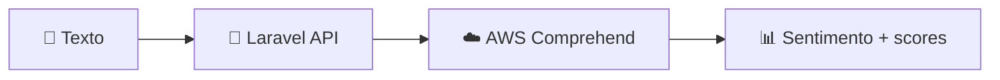

# 🪐 SatellaSoft Labs · Laravel + AWS

<p align="center">
  
  
  
</p>

Este repositório concentra os **labs da SatellaSoft**: experimentos práticos para integrar Laravel aos serviços da AWS. Cada mecanismo é uma pequena peça de produto — simples de executar, fácil de evoluir e pronta para aprender fazendo.

## ⚡ Lab atual: Amazon Comprehend

Análise de sentimento em português via API REST.



| Endpoint | Payload |
| --- | --- |
| `POST /api/comprehend/sentiment` | `{ "text": "O atendimento foi excelente!" }` |

## 🚀 Rodando localmente

```bash
composer install
cp .env.example .env
php artisan key:generate
```

Configure as credenciais da AWS no `.env`:

```env
AWS_ACCESS_KEY_ID=...
AWS_SECRET_ACCESS_KEY=...
AWS_DEFAULT_REGION=us-east-1
```

Depois, suba a API com `php artisan serve`. Para testar o Comprehend, use o arquivo [http/comprehend.http](http/comprehend.http).

---

**SatellaSoft Labs** · explorando integrações que transformam ideias em soluções. ✨
